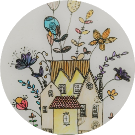
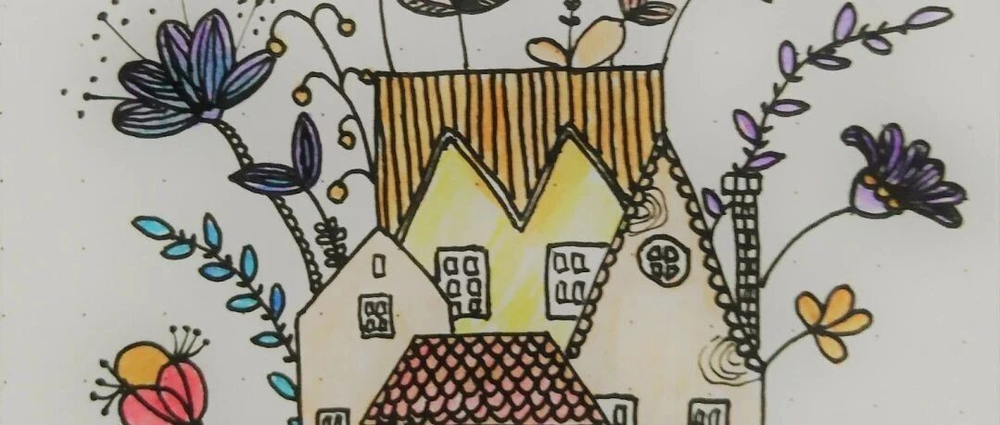

# 咨询师三妮的自我介绍

Hi！我是林日冉，英文名 Sunny（昵称三妮）。我是国家二级心理咨询师，受训过存在主义人际团体及巴林特小组的团体咨询师。个人执业，进行个体咨询及团体咨询带领。擅长成人来访（20~50 岁），以个人成长为方向的精神动力性长程咨询为主。

自从接触心理学以来，它给我的生活带来了很多的改变，我也希望能把这份力量传递给你。我相信人自身就具有向上的力量，我所做的就是营造一个温暖适宜的生长环境，种子会长成它自己的样子。

## 咨询取向

- **个体咨询**：精神动力学整合疗法
- **团体咨询**：存在主义动力性团体

## 主要心理学受训背景

### 长程培训

- 徐钧自体心理学高级研修班（72 学时）
- 张沛超精神分析基础研修班（72 学时）
- 张沛超精神分析连续培训中级班（90 学时）
- 壹心理 心理咨询技术与疗法入门（76 学时）
- 壹心理 新手咨询师必修课（100 学时）
- 壹心理 咨询师高阶训练营（培训+实习）
- 欧文·亚隆认证团体咨询师培训（220 学时）
- 精神分析理论与实务系统培训（180 学时）
- EFT 情绪聚焦疗法系统培训（132 学时）
- ITF 第 8、9 届巴林特组长培训（75 学时）

### 短程培训

- 潜意识图像卡认证治疗师（16 学时）
- 李明人本主义聚焦基础课（51 学时）
- 杨新国危机干预工作坊（18 学时）
- 郭海峰正念减压工作坊（30 学时）
- 李仑存在主义团体初级组（38 学时）
- 孙平 科胡特及其后继者·自体（36 学时）

## 个人体验

- 心理团体体验持续进行中（700 小时+）
- 2017 年至今个人体验进行中（500 小节+）

## 咨询经验

> 数据截至 2024 年 9 月

- 个体咨询 900 小时+
- 团体及小组带领 300 小时+
- 个体及团体督导持续进行中 200 小时+

---

hi！欢迎你来到阳光小屋！这是一个滋养心灵的花园，提供个体咨询、成长团体、读书会、观影会、播客等心灵养料，愿你开出自性的花朵，收获自在与欢喜。
